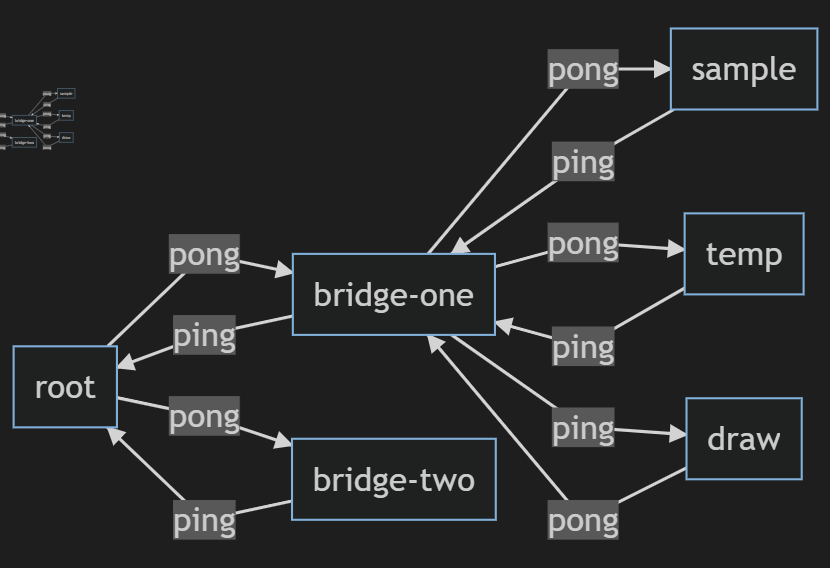

# Gnuttella p2p network

## Introduction
This project is meant to emulate working of multiple p2p nodes network operating without a central-node. The allows for apis to create a new node, connect with others, drop them if they don't respond, and propagate queries to enable search. Also, hit allows a node to identify if it has the requested file and push allows for transfer of file.

## Main classes
- Conversation - This class is used to marshall and unmarshall all communication between nodes as well as CLI-input from the users.
- CLI - listens for users input and processes custom requests 
- ConvListener - This class is used to listen to udp packets from other nodes and process them accordingly.
- ConvManager - Responsible for checking on neighbours i.e. pinging them and dropping them if they haven't responded in some time.

## Custom UDP classes
- PingPonger - This is responsible for creating a Ping or a Pong packet with the relevant information (address, port etc) and sending it to a node.
- Query - This is responsible for creating a Query packet with the relevant information (file name, originator's address etc) and sending it to all the neighbouring nodes.
- QueryHit - This is responsible for creating a QueryHit packet with the relevant information (list of file names, sizes, and sender's address etc) and sending it to the requesting node.
- PushCommand - This is responsible for creating a Push packet with the relevant information (file name, requestor's address etc) and sending it to the node with the file - expecting it to send back the file.

## Custom TCP classes
- PushDataSender - Right after receiving a Push packet with a fileName, if we have the file we send it to the requestor's address/port over TCP. This class is responsible for sending the data
- PushDataReceiver - Right before sending a Push packet, the requester starts a TCP server to receive the file on the specified address/port. Additionally, this class is also responsible for saving the file in the user's folder

## Entry point
The Node takes two inputs, the address and user's name (to be used as folder name). There are three threads that get activated when we start Node (which is the main entry point):
- CLI - This will process input from the user (for instance 'ping address=localhost:8080')
- ConvListener - This thread will process any Conversation (ping, pong, query etc.) coming from other nodes
- ConvManager - This thread manages all the nodes i.e. drops them if they haven't responed after a while

## Makefile
- make - compiles all the necessary java files
- make clean - cleans all the .class files

## Sample initialise
For starting a node for Musk, at localhost and port 8000, we will enter the following
```
make
java Node address=localhost:8000,name=Musk
```

## Sample CLI:
```
ping address=localhost:8000 
query name=cat,TTL=2
push name=catPair.jpg,address=localhost:8000 
```

# Test: 
### Test starts with a ***root*** node 
### Next we have two nodes join them, ***bridge-one*** and ***bridge-two***
### Next we have two nodes joining  ***bridge-one*** , first the ***sample*** and next ***temp***. Next ***temp*** leaves the network
### ***bridge-one*** is alerted of ***temp*** leaving and tries to add ***draw*** to the network
### ***bridge-two*** starts a new query for 'cat' pictures
### ***draw*** is the only one with cat pictures
### The direction of query is as follows - ***bridge-two*** -> ***root*** -> ***bridge-one*** -> ***sample*** & ***draw*** - this will require a minimum of TTL=3
### ***draw*** should report a hit to ***bridge-two***
### ***bridge-two*** should request a push and get the reqested picture in the ***bridge-two*** folder



# Terminal preview of the test:

## Terminal root
```
$ make
# generating all the necessary class files - To run enter 'java Node address=localhost:8000,name=Musk'
$ java Node address=localhost:8011,name=root
Adding neighbour => localhost:8021
Adding neighbour => localhost:8022
^C
```
## Terminal bridge-one
```
$ java Node address=localhost:8021,name=bridge-one
ping address=localhost:8011
adding new neighbour => localhost:8011
Adding neighbour => localhost:8031
Adding neighbour => localhost:8032
Killing node at address=localhost:8032
ping address=localhost:8033
adding new neighbour => localhost:8033
Killing node at address=localhost:8011
^C
```
## Terminal bridge-two
```
$ java Node address=localhost:8022,name=bridge-two
ping address=localhost:8011
adding new neighbour => localhost:8011
query name=cat,TTL=1
query name=cat,TTL=2
query name=cat,TTL=3
We got a hit from = localhost:8033
START RESULTS --->
catPair.jpg    34 KB
catWithGlasses.jpg    63 KB
<--- END RESULTS
push name=catWithGlasses.jpg,address=localhost:8033
Successfully received catWithGlasses.jpg
Killing node at address=localhost:8011
^C

```
## Terminal sample
```
$ java Node address=localhost:8031,name=sample
ping address=localhost:8021
adding new neighbour => localhost:8021
Killing node at address=localhost:8021
```
## Terminal temp
```
$ java Node address=localhost:8032,name=temp
ping address=localhost:8021
adding new neighbour => localhost:8021
^C
```
## Terminal draw
```
$ java Node address=localhost:8033,name=draw
Adding neighbour => localhost:8021
Successfully sent
Killing node at address=localhost:8021
^C
$ make clean
# cleaning up all th extra files
```

### Transferred document catWithGlasses.jpg was successfully saved in the bridge-two folder
<br>

# Notes
- Rather than announcing the size and number of files upon ping, node only shares the match when queried - I though this was a simpler implementation and easier to check
- Rather than a unique id for a request/query, we use a combination of time, address, and query term to identify it - significantly lowering the chance of collision