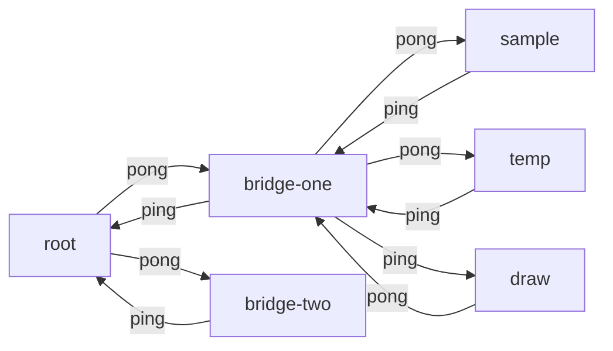

```mermaid
graph LR;
    A[root] --> | pong| B[ bridge-one];
    A[root] --> | pong| C[ bridge-two];
    B --> |ping| A
    C --> |ping| A
    B --> | pong| B1[ sample];
    B --> | pong| B2[ temp];
    B --> | ping| B3[ draw];

    B1 --> |ping| B
    B2 --> |ping| B
    B3 --> |pong| B
```